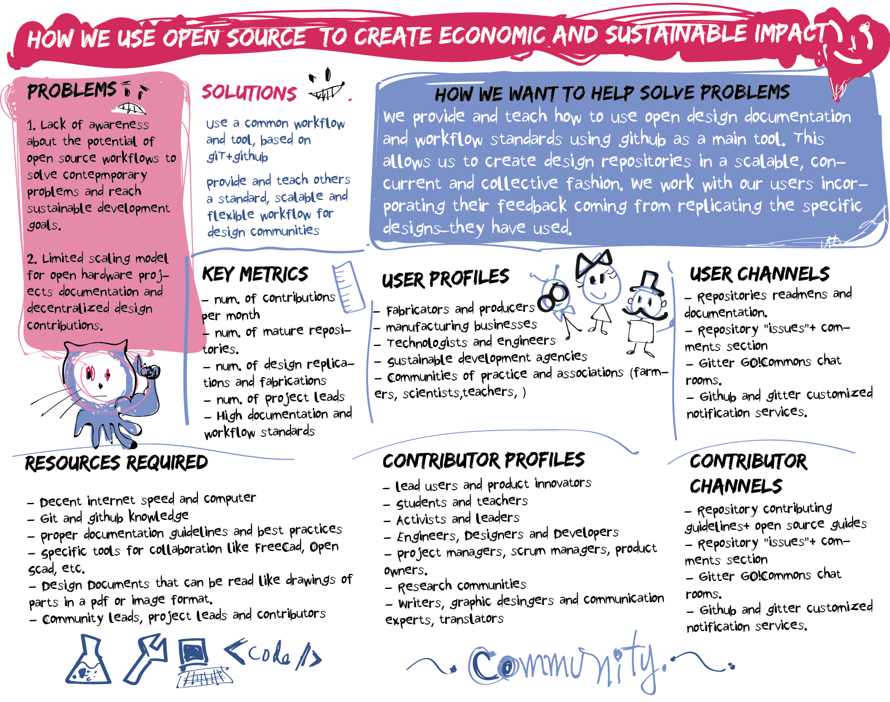

# Welcome to this open source project
This repository has specific structure inspired in the [open hardware repository project structure guidelines](https://www.ohwr.org/projects/ohr-support/wiki/project-structure-guidelines). It has been also provided and organized by GO!Commons a community and initiative focused on the role of open source to accelerate sustainable development and deliver economic empower to producers, and commoners.

## About the structure and organization of the repository
The wiki is a very important part of the documentation structure of this repo. It will give you a quick introduction to the particularities of this design, how it is used, how it works, why it exists, but also the functional description of it etc.
### For users
If you are interested in understanding how this machine/product works, you can learn from reading the documentation. If you want to use the files in your projects, and make your own redesigns you are also welcome. Make sure to read the rights and attributions you have as a user in the [LICENSE.md](LICENSE.md).

### For contributors
If you want to learn open source by doing things, and you are interested in participating in this project in particular. Contact us or leave a comment on the #issues you are interested in participating. Some issues are for advanced developers others, are for beginners.

**don't be shy, we encourage that people partner up, and we also promote that experience people play a mentor role so that others can grow as well**

#### You can see the different roles in the GO!Commons canvas, where we lay out the different roles that can participate. If you think your role is not captured or expressed, also feel free to reach out. You can also select the one that you fill more close to and start learning and finding your own contributor profile along the way.!!

